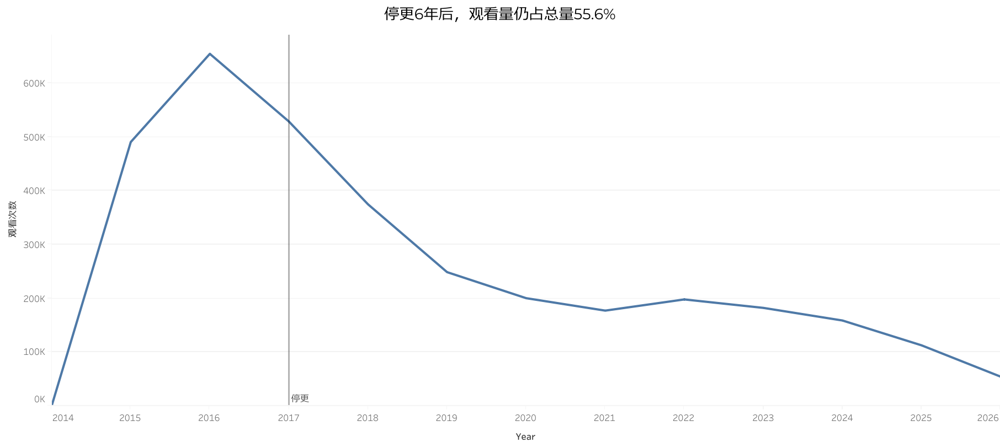
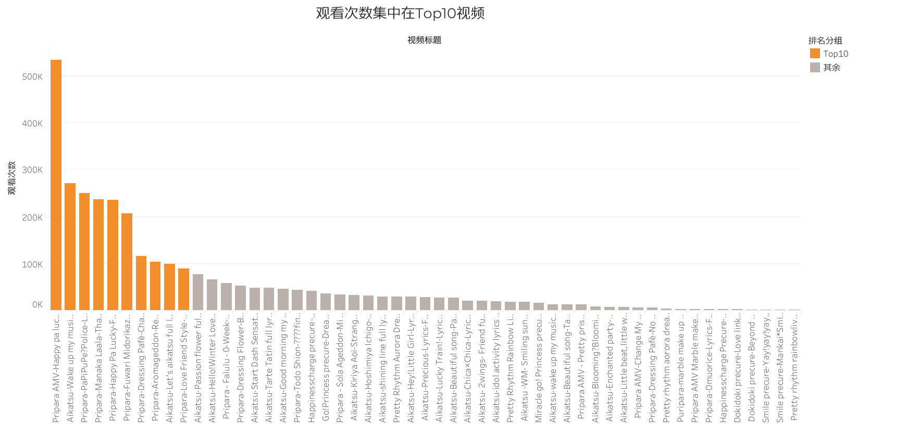
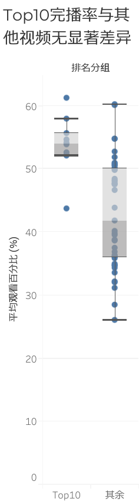
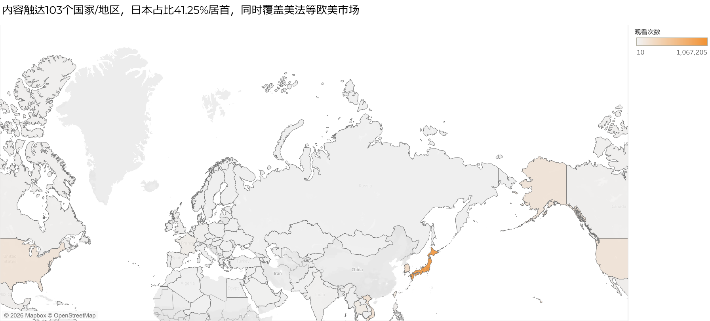
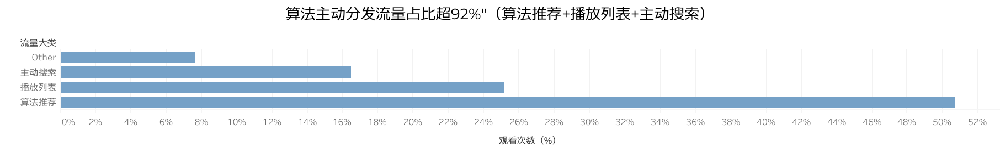

# 复盘YouTube频道数据

## 一、项目背景

- **频道基本情况**：2014年12月开设，动漫歌词二创剪辑（自制歌词图+音源和画面剪辑），2017年停更，运营约3年。
- **核心量级**：累计观看338万次，观看时长约1.2万小时，53个视频，4,299订阅
- **分析动机**：时隔多年，用现在具备的数据方法论回看当年的运营行为

## 二、数据说明

- **数据来源**：YouTube Studio导出报表，覆盖内容/地域/流量三个维度
- **时间范围**：2014-12至2026-08
- **处理方法**：统一日期格式、剔除总计行
- **口径说明**：
  - 跨报表总计之间存在极小幅度误差（约0.0001%），确认可忽略
  - 53个视频的观看次数逐条相加为316万，与总计的338万存在约22万（6.5%）的差额，经核实为个别视频因歌曲版权申诉被下架所致——这些视频历史产生的观看量仍计入频道总计，但已从视频明细报表中移除；地域细分数据同样存在类似缺口（103个国家/地区逐项相加为258.7万，占总量76.5%），推测为同一批下架视频的地域分布数据一并消失所致。本报告的头部量级数字统一采用总计口径（338万），涉及视频级或地域级细分占比时，均以对应细分数据的合计为分母
- **分析工具**：Excel + MySQL

## 三、核心发现

1. **长尾效应**：最后一条视频发布于2017年5月，此后（2017年6月起）产生的观看量占总量的59.2%，逐年衰减但从未归零

2. **头部集中**：Top10贡献68%观看，长尾分布

3. **内容质量稳定**：完播率40%-50%区间，Top10与其余无显著差异

4. **国际化传播**：在能归属到具体国家的观看量中，日本占比41.3%居首，亚洲整体约86.7%，同时触达美国、法国等欧美市场

5. **流量结构健康**：算法推荐+播放列表+搜索合计占92.36%，平台系统主动分发为主

6. **系列级差异**：Pripara系列表现（观看/完播率）显著优于Aikatsu系列

7. **停更原因是供给枯竭而非质量下滑**：Aikatsu完播率前后两批几乎持平，说明转向Pripara并非内容变差

## 四、结论与能力总结

这些数据具体证明了以下几项能力：

- **选题判断**：Aikatsu原作完结、无新素材可二创后，转向了当时仍在连载的Pripara系列。事后数据显示这次转向是对的——Pripara系列平均观看是Aikatsu的2.5倍以上，说明及时识别"内容供给是否可持续"并调整资源投入方向，即便当时的直接动机是被动应对，结果也验证了方向正确。
- **SEO搜索优化能力**：频道的主动搜索流量达16.47%，加上算法推荐与播放列表分发，系统主动分发流量合计超92%，说明标题与关键词设置有效。
- **内容供给周期识别**：Aikatsu素材枯竭后，及时转向仍持续产出的动漫进行二创，保持内容生产的连续性。
- **跨文化内容穿透力**：即使歌词以罗马拼音呈现，日本市场依然是最大受众来源；同时频道触达了美国、法国等欧美市场，具备一定的跨文化传播能力。

由于数据的局限性（缺少涨粉曲线、社群互动、A/B测试等主动运营动作的记录），此报告仅能证明本人的**内容制作与选题判断力**，不直接等同于完整意义上的"运营经验"。

---

可视化内容由Tableau制作：https://public.tableau.com/views/Youtubechannel_17867041663510/sheet0?:language=en-US&:sid=&:redirect=auth&:display_count=n&:origin=viz_share_link
